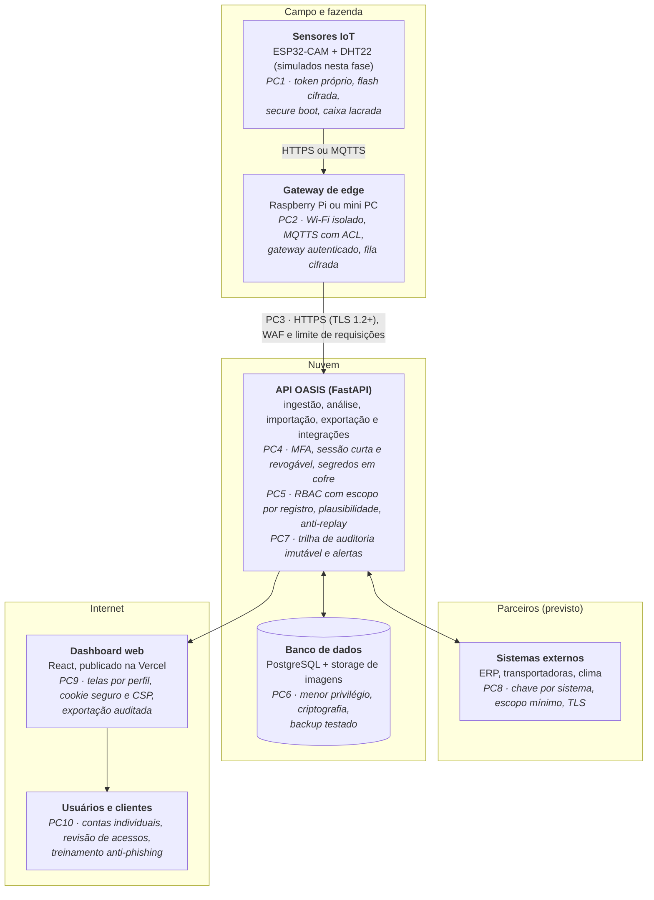

# Diagnóstico e Plano Preliminar de Segurança da Informação — Dashboard Climático e Logístico (OASIS)

**Projeto Integrador — Segurança em Sistemas de Informação — 1ª AV** · versão 1.0 · outubro de 2026

## Sumário

- [Apresentação](#apresentação)
- [1. Contextualização da solução](#1-contextualização-da-solução)
- [2. Inventário de ativos](#2-inventário-de-ativos)
- [3. Classificação das informações](#3-classificação-das-informações)
- [4. Análise de Confidencialidade, Integridade e Disponibilidade](#4-análise-de-confidencialidade-integridade-e-disponibilidade)
- [5. Identificação dos atores](#5-identificação-dos-atores)
- [6. Matriz preliminar de acesso (RBAC)](#6-matriz-preliminar-de-acesso-rbac)
- [7. Identificação de ameaças](#7-identificação-de-ameaças)
- [8. Identificação de vulnerabilidades](#8-identificação-de-vulnerabilidades)
- [9. Construção dos cenários de risco](#9-construção-dos-cenários-de-risco)
- [10. Matriz de riscos](#10-matriz-de-riscos)
- [11. Proposta inicial de controles de segurança](#11-proposta-inicial-de-controles-de-segurança)
- [12. Política de Controle de Acesso (PCA-01)](#12-política-de-controle-de-acesso-pca-01)
- [13. Arquitetura preliminar de segurança](#13-arquitetura-preliminar-de-segurança)
- [14. Conclusão: os cinco riscos prioritários](#14-conclusão-os-cinco-riscos-prioritários)
- [Referências](#referências)

## Apresentação

A OASIS já tem controles sólidos para um protótipo, mas cinco riscos — liderados pelo segredo JWT padrão publicado no código e pela futura base de clientes — precisam ser tratados antes de qualquer uso real (seção 14).

| Item | Descrição |
| --- | --- |
| Trabalho | Projeto Integrador “Inteligência de Dados no Vale do São Francisco” — Segurança em Sistemas de Informação — 1ª AV |
| Equipe | PI-2026-2-Vinícola — Antonio Vinicius, Lucas Vinicius, Renan Souza e Vitória Barboza |
| Objeto | Dashboard Climático e Logístico da vinícola, implementado como plataforma OASIS (Observação Agroambiental Sensorizada, Inteligente e Sustentável) |
| Fontes | Código e documentação dos repositórios Vinicola-back, Vinicola-Front e Vinicola-bd (versão de 01/10/2026); evidências citadas como `repositório/caminho` |
| Escopo | O que já está implementado (sensores, edge, API, banco e dashboard) e o que está previsto (módulos logístico, comercial e de clientes, marcados como “previsto”) |
| Natureza | Diagnóstico e planejamento: nenhum controle proposto foi implementado nesta etapa; o RBAC técnico fica para a 2ª unidade |

Convenções: A = ativo, AM = ameaça, V = vulnerabilidade, CR = cenário de risco, R = risco, C = controle, PC = ponto de controle. Níveis: Baixa, Média, Alta e Crítica; probabilidade e impacto de 1 a 5.

## 1. Contextualização da solução

O Dashboard Climático e Logístico reúne em uma plataforma web o clima de cada talhão, a qualidade das uvas medida por visão computacional e, na versão planejada, a logística e o comercial da exportação. Hoje estão implementadas a coleta, a análise e a visualização; os módulos logístico e comercial estão previstos.

Fluxo dos dados: sensor IoT no vinhedo → gateway de edge na fazenda → API OASIS na nuvem → banco de dados e imagens → dashboard web → usuários (desenho completo na seção 13).

| Elemento | Como funciona na OASIS | Situação |
| --- | --- | --- |
| Objetivo do dashboard | Apoiar decisões de colheita, irrigação, armazenamento, transporte e venda com dados confiáveis do vinhedo: clima do talhão, qualidade e maturação dos cachos, alertas e estado dos sensores | Implementado (clima e qualidade) |
| Principais usuários | Administrador, gestor (agrícola e diretoria) e operador (técnico de campo), já existentes como perfis; analista de dados, logística, comercial e clientes | Perfis atuais + previstos |
| Dados utilizados | Imagens dos cachos; resultado da análise (variedade, qualidade, maturação, classificação e caixas detectadas); temperatura, umidade do ar, luminosidade e umidade do solo; bateria, sinal e firmware dos sensores; arquivos importados (CSV, Excel, JSON); usuários e auditoria | Implementado |
| Sensores IoT simulados | Firmware ESP32-CAM com DHT22 (`Vinicola-back/iot/esp32-cam`). Sem hardware, a simulação usa envio HTTP com o token do sensor, o gateway de edge e o gerador de dados sintéticos `python -m app.cli seed-demo` (sensores DEMO-01 a DEMO-03, origem “demonstracao”) | Implementado |
| Aplicação web (dashboard) | React + TypeScript (Vite) com dashboard, sensores, análises, classificação, histórico, importação e administração (`Vinicola-Front`); site estático preparado para a Vercel | Implementado |
| API | FastAPI em `/api/v1`: login com JWT, perfis, ingestão de imagens, leituras, indicadores, importação, exportação CSV e auditoria (`Vinicola-back/app`) | Implementado |
| Banco de dados | PostgreSQL 16 (recomendado) ou MySQL; SQLite no desenvolvimento; 9 tabelas e 10 visões analíticas (`Vinicola-bd`). Firebase existe só como proposta | Implementado |
| Ambiente em nuvem | API empacotada em contêiner Docker (Python 3.11, sem root) e frontend preparado para a Vercel (`vercel.json`); planejado um PostgreSQL gerenciado. Hoje as imagens ficam em disco local (`storage/`) e o provedor da API não está definido | Parcial |
| Informações logísticas | Janela de colheita por talhão, lotes, câmara fria, cargas, transportadoras, rotas e datas de embarque, planejadas a partir da maturação e do clima | Previsto |
| Informações comerciais | Contratos, preços, volumes negociados, previsões de safra e de vendas | Previsto |
| Clientes nacionais e internacionais | Razão social, CNPJ ou Tax ID, contatos (nome, e-mail, telefone), endereços de entrega, pedidos e condições comerciais; dados pessoais sujeitos à LGPD e, para clientes da União Europeia, ao GDPR | Previsto |

### A solução vista pela Segurança da Informação

- **Portas de entrada:** dispositivos (cabeçalho `X-Device-Token`), pessoas (login e JWT), arquivos importados e duas rotas públicas (`/varieties` e `/public/overview`).
- **Confidencialidade pesa mais** em credenciais, segredos, dados comerciais e de clientes.
- **Integridade pesa mais** nos dados do campo: uma leitura adulterada leva a decisões erradas de colheita, armazenamento e transporte.
- **Disponibilidade pesa mais** na API e no dashboard durante a colheita; o gateway de edge guarda as imagens em fila quando a internet cai.

### Controles que já existem

| Controle existente | Evidência |
| --- | --- |
| Senhas com PBKDF2-SHA256 (240 mil iterações) e sal aleatório | `Vinicola-back/app/security.py` |
| Sessão JWT com expiração e perfis admin, gestor e operador verificados no servidor | `app/deps.py`, `app/security.py` |
| Bloqueio após 5 tentativas de login em 15 minutos, por e-mail e por IP | `app/routers/auth.py` |
| Token individual por sensor, exibido uma única vez, guardado como hash SHA-256 e regenerável | `app/routers/sensors.py` |
| Validação de imagem (formato, limite de 8 MB, proteção contra “bomba” de descompressão) e remoção de EXIF/GPS | `app/services/storage.py` |
| Consultas parametrizadas, curingas da busca escapados e CSV protegido contra injeção de fórmulas | `app/routers/readings.py` |
| CORS restrito e cabeçalhos `nosniff`, `X-Frame-Options`, `Referrer-Policy` e `Cache-Control: no-store` | `app/main.py` |
| Modo produção recusa segredo padrão, leitura pública e CORS “*”, e desliga `/docs` | `app/config.py`, `app/main.py` |
| Auditoria de logins, alterações, tokens, importações e exclusões, com IP | `app/services/audit.py` |
| Contêiner sem root e banco publicado só em 127.0.0.1 no Docker | `Dockerfile`, `docker-compose.yml` |
| 52 testes automatizados (Pytest), incluindo autenticação e permissões | `Vinicola-back/tests` |

## 2. Inventário de ativos

Foram identificados 26 ativos; 9 são críticos e se concentram em dados (resultados de qualidade, comerciais, clientes, credenciais e segredos) e no núcleo formado por API, autenticação e banco.

| ID | Ativo | Categoria | Finalidade | Responsável | Criticidade |
| --- | --- | --- | --- | --- | --- |
| A01 | Medições climáticas e ambientais (temperatura, umidade do ar, luminosidade, umidade do solo) | Informação | Monitorar o microclima de cada talhão e alimentar o dashboard climático | Gestor agrícola | Alta |
| A02 | Imagens dos cachos e resultados da análise (qualidade, maturação, classificação, detecções) | Informação | Indicar a condição das uvas e apoiar a decisão de colheita e expedição | Gestor agrícola | Crítica |
| A03 | Cadastro, localização (GPS) e telemetria dos sensores | Informação | Localizar os dispositivos e acompanhar bateria, sinal e firmware | Administrador da plataforma | Média |
| A04 | Dados logísticos (previsto): colheita programada, lotes, câmara fria, cargas, rotas, embarques | Informação | Planejar colheita, armazenamento e transporte até o cliente | Gerente de logística | Alta |
| A05 | Informações comerciais (previsto): contratos, preços, volumes, previsões de safra e de venda | Informação | Negociar e cumprir contratos com compradores | Gerente comercial | Crítica |
| A06 | Dados de clientes nacionais e internacionais (previsto) | Informação | Atender pedidos, faturar e entregar | Gerente comercial, com o Encarregado de dados (DPO) | Crítica |
| A07 | Contas de usuários e credenciais (nome, e-mail, hash de senha, perfil) | Informação | Identificar e autenticar cada pessoa | Administrador da plataforma | Crítica |
| A08 | Segredos técnicos: `JWT_SECRET`, senhas do banco, tokens dos sensores, senha do Wi-Fi, chaves de API | Informação | Autenticar sistemas e dispositivos entre si | Responsável pela infraestrutura | Crítica |
| A09 | Trilha de auditoria, histórico de importações e logs | Informação | Rastrear quem fez o quê e investigar incidentes | Administrador da plataforma | Alta |
| A10 | Dashboard web OASIS (`Vinicola-Front`) | Software | Apresentar indicadores, mapa, alertas e históricos | Equipe de desenvolvimento (frontend) | Alta |
| A11 | API OASIS (`Vinicola-back/app`), com análise de imagem e importação | Software | Receber, validar, analisar, guardar e servir todos os dados | Equipe de desenvolvimento (backend) | Crítica |
| A12 | Gateway de edge (`edge/gateway.py`) | Software | Descartar imagens ruins, comprimir e manter fila offline na fazenda | Equipe de IoT | Alta |
| A13 | Firmware dos sensores (`iot/esp32-cam`) | Software | Capturar imagem e clima e enviar ao edge ou à API | Equipe de IoT | Média |
| A14 | Modelo de IA (pesos YOLO e dataset anotado, `ml/`) | Software | Detectar cachos, variedades e anomalias | Equipe de dados e IA | Alta |
| A15 | Banco de dados (PostgreSQL ou MySQL; SQLite no desenvolvimento) | Infraestrutura | Guardar todos os registros da plataforma | Responsável pela infraestrutura (DBA) | Crítica |
| A16 | Armazenamento de imagens (`storage/`; futuro storage de objetos) | Infraestrutura | Guardar fotos processadas e miniaturas | Responsável pela infraestrutura | Alta |
| A17 | Ambiente em nuvem (hospedagem da API em Docker, Vercel, DNS e certificados TLS) | Infraestrutura | Executar e publicar a solução na internet | Responsável pela infraestrutura | Alta |
| A18 | Rede local da fazenda (Wi-Fi, broker MQTT, computador do gateway) | Infraestrutura | Ligar os sensores ao edge e à internet | Técnico de campo | Média |
| A19 | Sensores IoT (ESP32-CAM + DHT22; simulados nesta fase) | Hardware/IoT | Capturar imagens e medições no vinhedo | Técnico de campo | Alta |
| A20 | Serviço de autenticação e autorização (login, JWT, perfis, token de dispositivo) | Serviço | Garantir que cada pessoa e dispositivo acesse só o permitido | Administrador da plataforma | Crítica |
| A21 | Repositórios no GitHub (organização PI-2026-2-Vinicola, públicos) | Serviço | Versionar e publicar o código da solução | Equipe de desenvolvimento | Alta |
| A22 | Serviços externos: mapas (CARTO e Esri), previsão do tempo e, no futuro, ERP e transportadoras | Serviço | Complementar o dashboard e integrar a logística | Equipe de desenvolvimento | Média |
| A23 | Administrador da plataforma | Pessoas | Gerir usuários, sensores, tokens e configurações | Diretoria | Alta |
| A24 | Usuários internos (gestores, técnicos, analistas, logística, comercial) | Pessoas | Operar o dashboard e decidir com base nos dados | Gestor de cada área | Média |
| A25 | Reputação da vinícola exportadora e confiança dos clientes | Intangível | Sustentar contratos e o acesso a mercados internacionais | Diretoria | Crítica |
| A26 | Conformidade e rastreabilidade (LGPD, GDPR, exigências de importadores) | Intangível | Evitar sanções e comprovar a origem e a qualidade dos lotes | Diretoria, com o Encarregado de dados (DPO) | Alta |

Os responsáveis são papéis, não pessoas: a equipe deve indicar quem ocupa cada papel na vinícola do PI.

## 3. Classificação das informações

Credenciais, segredos e chaves são Restritos; dados comerciais, de clientes, logísticos e pessoais são Confidenciais; os dados operacionais do vinhedo são Internos; só o catálogo de variedades, números agregados, clima de fontes abertas e o código são Públicos.

### Níveis e regras de tratamento

| Nível | Quem pode acessar | Regras de tratamento |
| --- | --- | --- |
| Pública | Qualquer pessoa | Pode ser publicada; exige apenas integridade (não divulgar informação errada) |
| Interna | Colaboradores com conta ativa | Acesso autenticado; uso só para o trabalho; não divulgar fora da empresa |
| Confidencial | Somente perfis com necessidade de conhecer | Criptografia em trânsito e em repouso; acesso e exportação registrados em auditoria; proibido enviar para e-mail pessoal ou planilha fora do sistema |
| Restrita | Somente sistemas e o menor número possível de administradores | Nunca em código, planilha, chat ou log; guardada em cofre de segredos; rotação periódica e revogação imediata se exposta |

### Classificação e justificativa

| Informação | Classificação | Por que esse nível |
| --- | --- | --- |
| Catálogo de variedades e critérios de classificação (`/varieties`, páginas /uvas) | Pública | Conteúdo educativo já publicado na página inicial; a divulgação não causa dano |
| Indicadores agregados da página inicial (`/public/overview`) | Pública | Totais sem localização, imagens ou leituras individuais; a API já os expõe sem login |
| Dados climáticos de fontes abertas (previsões e estações meteorológicas) | Pública | Já são públicos na origem; o cuidado é garantir que a fonte seja legítima |
| Código-fonte dos repositórios | Pública | Os repositórios já são públicos no GitHub; por isso nunca podem conter segredos, e a segurança não pode depender de o código ser secreto |
| Medições ambientais dos sensores da fazenda | Interna | Pouco sensíveis isoladamente, mas revelam o microclima e a produtividade dos talhões; o ponto crítico é a integridade (seção 4) |
| Leituras de qualidade, imagens dos cachos e alertas | Interna | Uso operacional diário; se vazarem, expõem problemas fitossanitários que podem ser usados contra a vinícola em negociações |
| Localização dos sensores e mapa dos talhões | Interna | Coordenadas exatas facilitam furto e vandalismo de equipamentos instalados em campo aberto |
| Relatórios operacionais e exportações CSV | Interna | Consolidam o histórico; por isso toda exportação deve ser registrada (V-10) |
| Histórico consolidado de qualidade por safra e previsões de produção | Confidencial | Antecipa volume e qualidade da safra, informação valiosa para compradores e concorrentes |
| Dados logísticos (cargas, rotas, datas de embarque, transportadoras) | Confidencial | Expostos, facilitam roubo de carga e fraude na entrega, e revelam clientes e volumes |
| Informações comerciais (contratos, preços, margens, volumes negociados) | Confidencial | Segredo de negócio; o vazamento enfraquece a negociação e pode violar cláusulas de confidencialidade |
| Dados de clientes nacionais e internacionais | Confidencial | Incluem dados pessoais de contatos (LGPD e GDPR) e revelam a carteira; o vazamento gera sanção e perda de clientes |
| Dados pessoais dos usuários (nome, e-mail, último acesso, IP) | Confidencial | Protegidos pela LGPD; e-mails válidos alimentam phishing direcionado |
| Trilha de auditoria e logs | Confidencial | Mostram quem fez o quê e de qual IP; acesso só do administrador e nenhuma possibilidade de alteração, porque servem de prova |
| Pesos do modelo de IA e dataset anotado | Confidencial | Propriedade intelectual da equipe; um modelo adulterado classifica uvas de forma errada |
| Credenciais de usuários (senhas, hashes, senha inicial do administrador) | Restrita | Permitem assumir a identidade de alguém; um hash vazado permite ataque de força bruta fora do sistema |
| Segredos da aplicação (`JWT_SECRET`, `DATABASE_URL`, `POSTGRES_PASSWORD`) | Restrita | Quem tem o `JWT_SECRET` emite sessões de qualquer usuário, inclusive de administrador (V-01) |
| Tokens dos sensores e senha do Wi-Fi da fazenda | Restrita | Permitem enviar dados falsos em nome de um sensor e entrar na rede da fazenda |
| Chaves de API de serviços externos (clima, mapas, ERP, transportadoras) | Restrita | Permitem uso indevido em nome da vinícola e acesso a sistemas de parceiros |

Quando informações são combinadas, vale o nível mais alto: um relatório que cruza a qualidade de um lote com o cliente de destino é Confidencial.

## 4. Análise de Confidencialidade, Integridade e Disponibilidade

Nos dados do vinhedo o requisito dominante é a integridade; nos dados comerciais e de clientes, a confidencialidade; na API e no dashboard, a disponibilidade durante a colheita.

Foram analisados os ativos de criticidade Crítica e os quatro de criticidade Alta dos quais o objetivo do dashboard depende diretamente (A01, A04, A10 e A19). A25 não entra: um ativo intangível não tem C, I e D próprios, ele sofre o impacto final das falhas dos demais.

| Ativo | Confidencialidade | Integridade | Disponibilidade | Justificativa |
| --- | --- | --- | --- | --- |
| A01 Medições climáticas e ambientais | Média | Crítica | Alta | Não são segredo, mas um valor adulterado de temperatura ou umidade leva a irrigação, colheita e armazenamento errados; lacunas curtas são toleradas porque o edge guarda as capturas em fila |
| A02 Imagens e resultados de qualidade | Média | Crítica | Alta | Uma leitura “APROVADA” falsa pode liberar um lote com podridão para exportação; a imagem guardada é a evidência que permite revisar o resultado |
| A04 Dados logísticos (previsto) | Alta | Crítica | Alta | Data, destino ou temperatura de câmara fria errados fazem perder uma carga perecível; rotas e datas expostas facilitam roubo de carga; o embarque tem hora marcada |
| A05 Informações comerciais (previsto) | Crítica | Alta | Média | Preços e contratos vazados enfraquecem a negociação; um valor alterado gera faturamento errado; a consulta pode esperar algumas horas |
| A06 Dados de clientes (previsto) | Crítica | Alta | Média | Contém dados pessoais (LGPD e GDPR) e toda a carteira; endereço ou dados bancários alterados viabilizam fraude; uma parada curta não interrompe a operação |
| A07 e A08 Credenciais e segredos | Crítica | Crítica | Alta | Quem obtém um segredo assume qualquer identidade; um segredo trocado indevidamente bloqueia usuários e sensores; sem eles ninguém entra |
| A10 Dashboard web | Média | Alta | Alta | Exibe dados internos; um número exibido errado induz decisão errada; fora do ar, a equipe decide sem dados no pico da safra, embora a coleta continue |
| A11 e A20 API OASIS e autenticação | Alta | Crítica | Crítica | É o único caminho para os dados e o ponto onde o acesso é decidido: uma falha de integridade aqui anula os demais controles; parada interrompe ingestão, dashboard e integrações |
| A15 Banco de dados | Crítica | Crítica | Alta | Concentra dados pessoais, comerciais e hashes de senha e é a fonte única da verdade; sem backup, uma falha apaga o histórico |
| A19 e A12 Sensores IoT e gateway de edge | Baixa | Crítica | Alta | Guardam pouca informação própria (seus segredos são tratados em A08), mas um dispositivo violado envia dados falsos com credencial válida; sensor parado cria lacunas no monitoramento |

Como o enunciado da atividade destaca, os dados climáticos e dos sensores têm confidencialidade apenas Média ou Baixa, mas integridade Crítica: é isso que orienta os controles de validação da seção 11.

## 5. Identificação dos atores

Onze atores interagem com a solução: seis perfis internos, dois tipos de cliente e três atores técnicos. Três perfis já existem na API (`admin`, `gestor`, `operador`) e um tipo de credencial de máquina (token do sensor); os demais são previstos para os módulos logístico e comercial.

| Ator (perfil) | O que precisa acessar | Dados que utiliza | Ações que deve realizar | Ações que não deve realizar |
| --- | --- | --- | --- | --- |
| Administrador (`admin`, existe) | Administração, cadastro de sensores, auditoria e estado do sistema | Usuários, sensores, tokens, auditoria | Criar e desativar usuários, definir perfis, cadastrar sensores, gerar e revogar tokens, excluir leituras de teste, consultar a auditoria | Usar a conta admin no dia a dia; ler contratos e clientes sem necessidade; alterar ou apagar a auditoria; compartilhar a conta |
| Gestor agrícola ou diretoria (`gestor`, existe) | Dashboard, sensores, análises, importação e relatórios | Clima, qualidade, alertas, sensores, previsões e resumos logístico e comercial | Consultar toda a operação, importar dados históricos, registrar medições manuais, exportar relatórios | Cadastrar sensores ou gerar tokens; alterar resultados vindos de sensores; gerenciar usuários |
| Analista de dados (`analista`, previsto) | Histórico e exportações, somente leitura | Clima, qualidade, telemetria e previsões | Consultar, filtrar, exportar (com registro) e construir modelos de previsão | Alterar ou excluir registros; ver dados pessoais de clientes (recebe dados anonimizados) |
| Técnico agrícola ou agronômico (`operador`, existe) | Análises, classificação e histórico | Imagens, qualidade, maturação e clima do talhão | Enviar imagens, consultar leituras e alertas, registrar inspeções de campo | Enviar sinal de vida ou medição em nome de um sensor; exportar a base inteira; ver dados comerciais, logísticos e de clientes |
| Operador logístico (`logistica`, previsto) | Planejamento de colheita, cargas e transporte | Previsão de colheita, maturação por talhão, lotes, cargas, rotas e transportadoras | Criar e atualizar cargas, rotas e embarques; consultar maturação e clima | Alterar resultados de qualidade; ver preços e contratos; exportar dados de clientes |
| Setor comercial (`comercial`, previsto) | Clientes, contratos, pedidos e previsões de venda | Clientes, contratos, preços, volumes e qualidade por lote | Cadastrar clientes e contratos; consultar qualidade e logística dos pedidos | Alterar dados de qualidade ou de logística; exportar clientes sem registro; enviar dados para e-mail pessoal |
| Cliente nacional (`cliente`, previsto) | Portal com os próprios pedidos | Situação dos pedidos, laudos de qualidade e previsão de entrega dos próprios lotes | Consultar e baixar documentos dos próprios pedidos; atualizar o próprio contato | Ver dados de outros clientes, preços de terceiros, localização dos sensores ou dados internos |
| Cliente internacional (`cliente`, previsto) | O mesmo portal, com documentos de exportação | Próprios pedidos, certificados (fitossanitário e de origem) e rastreio do embarque | Consultar e baixar os próprios documentos | As mesmas proibições do cliente nacional; acessar dados fora do previsto no contrato de tratamento de dados |
| Sistema externo (`integracao`, previsto: ERP, transportadora, serviço de clima) | Somente os endpoints da sua integração | Pedidos, cargas, situação de entrega, previsão do tempo | Ler e enviar apenas os campos combinados, com chave própria e limite de requisições | Usar credencial de pessoa; acessar dados fora da integração |
| Sensor IoT (token do dispositivo, existe) | `/ingest`, `/sensors/{id}/heartbeat` e `/sensors/{id}/environment` | Os próprios dados: imagem, clima, bateria e sinal | Enviar dados apenas em seu próprio nome | Ler qualquer dado; enviar em nome de outro sensor; usar o token de outro dispositivo |
| Gateway de edge (serviço, existe) | Capturas da rede local e a rota de ingestão da API | Imagens e metadados em trânsito e na fila offline | Filtrar, comprimir, enfileirar e encaminhar capturas | Alterar resultados; guardar tokens em texto; aceitar capturas sem autenticação |

Esta tabela é a base do RBAC: cada linha vira um perfil, e as colunas “deve” e “não deve” viram as permissões da matriz da seção 6.

## 6. Matriz preliminar de acesso (RBAC)

A matriz aplica o menor privilégio: cada perfil recebe só o que sua função exige, e cinco regras atuais da API precisam mudar para segui-la. Nesta unidade ela é projeto de autorização; a implementação fica para a 2ª unidade.

| Recurso | Admin | Gestor | Analista | Técnico | Logística | Comercial | Cliente | Sensor IoT |
| --- | --- | --- | --- | --- | --- | --- | --- | --- |
| Usuários e perfis | CRUD | Próprio | Próprio | Próprio | Próprio | Próprio | Próprio | — |
| Sensores (cadastro e localização) | CRUD | R | R | R | — | — | — | Próprio (U do estado) |
| Tokens de dispositivo | C, D | — | — | — | — | — | — | — |
| Imagens e leituras de qualidade | R, D | R | R | C, R | R | R | Próprio (laudo) | C (próprias) |
| Medições climáticas e ambientais | R, D | C, R | R | R | R | — | — | C (próprias) |
| Indicadores do dashboard | R | R | R | R | R | R | — | — |
| Importação de leituras e medições | C, R | C, R | — | — | — | — | — | — |
| Importação de sensores | C, R | — | — | — | — | — | — | — |
| Exportação CSV (sempre auditada) | R | R | R | — | R (logística) | R (comercial) | — | — |
| Auditoria e estado do sistema | R | — | — | — | — | — | — | — |
| Dados logísticos (previsto) | — | R | R | — | CRUD | R | Próprio (entrega) | — |
| Informações comerciais (previsto) | — | R | — | — | — | CRUD | Próprio (contratos) | — |
| Clientes (previsto) | — | R | — | — | R (entrega) | CRUD | Próprio (R, U do contato) | — |

Legenda: C = Create (criar), R = Read (ler), U = Update (alterar), D = Delete (excluir); Próprio = apenas os registros do próprio usuário, cliente ou dispositivo; — = sem acesso.

- **Nenhum perfil altera (U) uma leitura ou medição vinda de sensor:** uma correção vira um novo registro de revisão, com justificativa (C-17).
- **O administrador gerencia acessos, não o conteúdo de negócio:** não lê contratos nem clientes. Suporte a esses módulos usa acesso temporário, aprovado pelo gestor comercial e registrado.
- **Exportação é uma permissão própria:** quem pode ler na tela não pode, automaticamente, baixar a base inteira.

### Lacunas entre a matriz e o código atual

| Regra planejada | Comportamento atual da API | Evidência |
| --- | --- | --- |
| Sinal de vida e medição de sensor só pelo próprio dispositivo; medição manual só por admin ou gestor | Qualquer usuário autenticado, inclusive operador, envia sinal de vida, medição e imagem para qualquer sensor | `Vinicola-back/app/deps.py` (`authorize_device`), `app/routers/sensors.py` |
| Cadastro de sensores só pelo admin | Gestor cria e altera sensores pela importação de arquivo | `app/services/imports.py` (`persist`), `app/routers/imports.py` |
| Resultado de leitura de sensor imutável | Importação com “atualizar duplicados” sobrescreve qualidade e classificação de leituras de sensor, mantendo a origem “sensor” | `app/services/imports.py` (`persist`) |
| Exportação só para perfis autorizados e sempre auditada | Qualquer usuário autenticado exporta até 50.000 leituras, sem registro na auditoria | `app/routers/readings.py` (`export_readings`) |
| Escopo por registro (“Próprio”) | Os três perfis são globais: não há filtro por talhão, cliente ou dono do registro | `app/deps.py` (`reader`, `require_roles`) |

A interface (`Vinicola-Front/src/services/api.ts`) já esconde parte dessas ações, mas quem decide é o servidor: uma regra que só existe na tela é contornada com uma chamada direta à API.

## 7. Identificação de ameaças

Foram identificadas 14 ameaças, todas com alvo concreto no inventário; as de maior peso são a falsificação de identidade, a manipulação dos dados dos sensores e o vazamento de dados comerciais e de clientes.

Ameaça é o agente ou evento que pode causar dano (o ladrão); vulnerabilidade é a fraqueza que ele explora (a porta destrancada, seção 8); risco é a chance e o tamanho do dano quando os dois se encontram (seções 9 e 10).

| ID | Ameaça | Origem | Ativos-alvo | Como se manifesta no projeto |
| --- | --- | --- | --- | --- |
| AM-01 | Roubo de credenciais e phishing | Externa | A07, A23, A24 | E-mail falso de “atualização da OASIS” captura a senha de um gestor; senha reaproveitada de outro serviço vazado |
| AM-02 | Falsificação de identidade ou de sessão | Externa | A20, A11, A08 | Token JWT forjado com um segredo conhecido; uso de credenciais padrão ou de demonstração |
| AM-03 | Acesso indevido a dados | Externa ou interna | A04, A05, A06, A02 | Usuário ou cliente consulta registros que não são seus, por exemplo o cliente A vendo pedidos do cliente B |
| AM-04 | Abuso de privilégios | Interna | A02, A01, A03, A09 | Gestor reimporta leituras para “aprovar” um lote; operador lança medições falsas em nome de um sensor |
| AM-05 | Vazamento ou exfiltração de informações | Interna ou externa | A05, A06, A04, A02 | Exportação em massa de leituras e, no futuro, da carteira de clientes, para concorrente ou e-mail pessoal |
| AM-06 | Manipulação de dados dos sensores | Externa | A01, A02, A19, A12 | Envio de temperatura, umidade ou imagens adulteradas em nome de um sensor; reenvio de capturas antigas com outra data |
| AM-07 | Interceptação de comunicação | Externa | A18, A08, A01 | Captura do token e das imagens no Wi-Fi da fazenda ou no MQTT sem criptografia |
| AM-08 | Malware, ransomware e dependência comprometida | Externa | A11, A15, A16, A21, A24 | Pacote Python ou npm malicioso instalado no build; ransomware no servidor ou no computador do administrador |
| AM-09 | Falha de infraestrutura ou do provedor de nuvem | Ambiental ou técnica | A15, A16, A17 | Disco corrompido, contêiner recriado sem volume persistente, interrupção do provedor |
| AM-10 | Exclusão ou alteração indevida de registros | Interna ou externa | A02, A09, A15 | Leituras excluídas por engano; trilha de auditoria apagada para esconder um acesso |
| AM-11 | Indisponibilidade por sobrecarga ou falta de conectividade | Externa ou ambiental | A11, A10, A18 | Envio massivo de imagens para `/ingest`; queda de internet ou de energia no campo durante a colheita |
| AM-12 | Exposição de dados por configuração inadequada da nuvem | Interna (erro) | A15, A16, A08, A17 | Banco ou bucket acessível pela internet, segredo visível em log ou variável, `/docs` aberto em produção |
| AM-13 | Furto, vandalismo ou violação física de dispositivos | Física | A19, A18 | Sensor arrancado do vinhedo e analisado para extrair o token e a senha do Wi-Fi |
| AM-14 | Fraude por engenharia social contra comercial e logística | Externa | A05, A06, A04, A25 | E-mail se passando por cliente internacional pede troca de dados bancários ou do endereço de entrega |

## 8. Identificação de vulnerabilidades

Foram encontradas 16 vulnerabilidades, todas com evidência no código ou na configuração dos repositórios; as mais graves são o segredo JWT padrão (V-01) e a comunicação IoT sem criptografia (V-05).

Cada linha é uma fraqueza do próprio sistema, algo que a equipe controla e pode corrigir; as ameaças da seção 7 são externas a ele. Por isso ameaça ≠ vulnerabilidade: phishing (AM-01) sempre existirá, mas a ausência de MFA (V-03) pode ser eliminada.

| ID | Vulnerabilidade (fraqueza) | Evidência | Ativos | Ameaças que a exploram |
| --- | --- | --- | --- | --- |
| V-01 | Segredo JWT padrão no código público: com `JWT_SECRET` vazio, a API assina sessões com um valor fixo do código; o ambiente padrão é `development`, que só emite um aviso | `Vinicola-back/app/config.py`, `.env.example`; repositório público | A20, A11, A08 | AM-02 |
| V-02 | Credenciais de demonstração no histórico público: senha fixa e e-mails dos perfis de demonstração de versões anteriores; bancos criados nessas versões mantêm esses usuários | Commits `77277e3` (back), `6a20a17` e `105a934` (front) | A07, A20 | AM-02, AM-01 |
| V-03 | Autenticação de fator único e senha fraca permitida: sem MFA; mínimo de 8 caracteres; a senha inicial do admin vinda de variável de ambiente não passa pela política, a gerada é impressa no log e a troca no primeiro acesso não é obrigatória | `app/schemas.py` (`check_password`), `app/seed.py` | A07, A23 | AM-01 |
| V-04 | Sessão longa e sem revogação: JWT válido por 8 horas; troca de senha e saída não invalidam o token; token guardado em `localStorage` e site sem Content-Security-Policy | `app/security.py`, `app/config.py`, `Vinicola-Front/src/services/http.ts`, `vercel.json` | A20, A10 | AM-01, AM-02 |
| V-05 | Comunicação IoT sem criptografia: firmware usa HTTP puro (`WiFiClient`) com `X-Device-Token` em texto; MQTT na porta 1883 sem TLS; gateway sem autenticação própria e com fila offline que grava o token em texto | `iot/esp32-cam/oasis_cam/oasis_cam.ino`, `config.example.h`, `edge/gateway.py` | A08, A18, A19, A12 | AM-07, AM-06 |
| V-06 | Origem e integridade dos dados de sensor não verificadas: sem assinatura nem proteção contra reenvio; `captured_at` aceita qualquer data passada; no MQTT, o tópico define o sensor e o gateway anexa o token legítimo | `app/routers/ingest.py`, `edge/gateway.py` (`start_mqtt`) | A01, A02 | AM-06 |
| V-07 | Permissões excessivas nos endpoints de dispositivo: qualquer usuário autenticado envia sinal de vida, medição e imagem para qualquer sensor | `app/deps.py` (`authorize_device`), `app/routers/sensors.py` | A01, A03 | AM-04, AM-06 |
| V-08 | Autorização sem escopo por registro: três perfis globais; a API entrega todos os sensores (com GPS), leituras e indicadores a qualquer perfil, e a interface apenas esconde telas | `app/deps.py` (`reader`), `Vinicola-Front/src/services/api.ts` | A02, A03; A05 e A06 no futuro | AM-03, AM-05 |
| V-09 | Importação contorna regras de perfil: gestor cria e altera sensores e sobrescreve leituras de sensor mantendo a origem “sensor”; a auditoria grava só contagens | `app/services/imports.py` (`persist`) | A02, A03, A09 | AM-04, AM-10 |
| V-10 | Exportação em massa sem restrição nem registro: até 50.000 leituras em CSV por qualquer usuário, sem auditoria | `app/routers/readings.py` (`export_readings`) | A02, A01 | AM-05 |
| V-11 | Bloqueio de login frágil e IP falsificável: contador em memória (zera ao reiniciar e não vale entre instâncias); IP lido do cabeçalho `X-Forwarded-For` enviado pelo cliente; 5 erros travam a conta do admin por 15 minutos; o tempo de resposta revela e-mails cadastrados | `app/routers/auth.py`, `app/deps.py` (`client_ip`) | A20, A09, A07 | AM-01, AM-11 |
| V-12 | Banco sem menor privilégio e auditoria alterável: a API conecta com o usuário dono do banco (superusuário na imagem oficial do PostgreSQL); não há GRANT ou REVOKE; `audit_log` pode ser alterada ou apagada | `Vinicola-back/docker-compose.yml`, `Vinicola-bd/postgres/01_schema.sql` | A15, A09 | AM-10, AM-12 |
| V-13 | Sem backup e sem armazenamento resiliente: imagens no disco local do contêiner; SQLite como padrão; nenhum backup automatizado nem criptografia em repouso | `app/services/storage.py`, `app/config.py`, `Vinicola-bd/docs/modelo-de-dados.md` | A15, A16 | AM-09, AM-08, AM-10 |
| V-14 | Sem limite de requisições e sem monitoramento: nenhuma limitação em `/ingest` (análise de imagem síncrona) nem nas demais rotas; logs só no console; nenhum alerta para ataques de senha, exportações ou sensores sem comunicação | `app/main.py`, `app/services/audit.py` | A11, A10 | AM-11, AM-01 |
| V-15 | Dependências sem versão fixa e sem varredura: `requirements.txt` com `>=`, sem lockfile Python e sem pipeline de CI que analise dependências | `Vinicola-back/requirements*.txt`; nenhum `.github/workflows` nos três repositórios | A11, A21 | AM-08 |
| V-16 | Segredos do sensor sem proteção física: Wi-Fi e token gravados em texto em `config.h`, na memória flash do ESP32 sem criptografia nem secure boot, em caixa instalada no campo | `iot/esp32-cam/README.md`, `config.example.h` | A19, A08, A18 | AM-13 |

No OWASP API Security Top 10 (2023), V-07 e V-09 são falhas de autorização por função (API5), V-08 de autorização por objeto e por propriedade (API1 e API3), V-03, V-04 e V-11 de autenticação (API2), V-14 de consumo irrestrito de recursos (API4), e V-01 e V-12 de configuração insegura (API8).

## 9. Construção dos cenários de risco

Os 11 cenários ligam cada ameaça a uma fraqueza real da OASIS; os dois mais graves (CR-01 e CR-03) entregam a um atacante a plataforma inteira ou a carteira de clientes. Cadeia usada: Ativo → Ameaça → Vulnerabilidade → Evento → Impacto.

**CR-01 — Sessão de administrador forjada**

- **Ativo:** API OASIS e autenticação (A11, A20)
- **Ameaça:** falsificação de identidade (AM-02)
- **Vulnerabilidade:** segredo JWT padrão publicado no código (V-01)
- **Evento:** a API vai ao ar com o `.env` de exemplo; um atacante assina um token para o e-mail padrão do administrador usando o segredo que está no GitHub
- **Impacto:** controle total — cria um administrador para si, lê e exporta todos os dados, exclui leituras e troca os tokens dos sensores; dano à reputação (A25)

**CR-02 — Clima adulterado no talhão**

- **Ativo:** medições climáticas e resultados de qualidade (A01, A02)
- **Ameaça:** interceptação (AM-07) seguida de manipulação dos dados (AM-06)
- **Vulnerabilidade:** HTTP e MQTT sem TLS, com token em texto (V-05); sem proteção contra reenvio (V-06)
- **Evento:** alguém ao alcance do Wi-Fi da fazenda captura o token de um sensor e passa a enviar temperatura e umidade falsas e imagens de outro talhão
- **Impacto:** decisões erradas de irrigação, colheita, armazenamento e transporte; lote fora do padrão chega ao cliente

**CR-03 — Cliente A vê os dados do cliente B**

- **Ativo:** dados de clientes e informações comerciais (A06, A05)
- **Ameaça:** acesso indevido (AM-03)
- **Vulnerabilidade:** autorização sem escopo por registro (V-08)
- **Evento:** no portal previsto, um importador troca o número do pedido no endereço da página e baixa contrato e preços de um concorrente
- **Impacto:** vazamento comercial, quebra de confidencialidade contratual, comunicação obrigatória do incidente à ANPD e aos titulares (LGPD, art. 48) e perda de clientes

**CR-04 — Lote reprovado vira “APROVADA”**

- **Ativo:** resultados de qualidade (A02) e trilha de auditoria (A09)
- **Ameaça:** abuso de privilégios (AM-04)
- **Vulnerabilidade:** importação sobrescreve leituras de sensor (V-09)
- **Evento:** pressionado pelo prazo de embarque, um gestor reimporta as leituras de um talhão com qualidade “Boa”; o registro continua com origem “sensor” e a auditoria guarda só contagens
- **Impacto:** uvas com podridão são expedidas; devolução da carga, multa contratual e perda de confiança do importador

**CR-05 — Senha de gestor capturada por phishing**

- **Ativo:** contas de usuários (A07) e dados operacionais (A01, A02)
- **Ameaça:** roubo de credenciais (AM-01)
- **Vulnerabilidade:** sem MFA e senha curta aceita (V-03); sessão sem revogação (V-04); exportação sem auditoria (V-10)
- **Evento:** o atacante entra com a senha do gestor e exporta o histórico de qualidade; mesmo após a troca da senha, o token roubado continua válido por até 8 horas
- **Impacto:** vazamento do histórico da safra e, com os módulos previstos, das previsões comerciais

**CR-06 — Histórico perdido após a recriação do servidor**

- **Ativo:** banco de dados e imagens (A15, A16)
- **Ameaça:** falha de infraestrutura (AM-09) ou ransomware (AM-08)
- **Vulnerabilidade:** sem backup e com armazenamento local (V-13)
- **Evento:** o contêiner é recriado sem volume persistente, ou o servidor é criptografado por ransomware
- **Impacto:** perda das imagens e leituras da safra; a vinícola não consegue comprovar a qualidade dos lotes exigida por importadores (A26)

**CR-07 — Dashboard fora do ar na colheita**

- **Ativo:** API e dashboard (A11, A10)
- **Ameaça:** indisponibilidade por sobrecarga (AM-11)
- **Vulnerabilidade:** sem limite de requisições e com análise de imagem síncrona (V-14)
- **Evento:** um token vazado ou um script com defeito envia um grande volume de imagens para `/ingest` e esgota a CPU da única instância
- **Impacto:** a equipe decide colheita e transporte sem dados no pico da safra; embarques atrasam

**CR-08 — Rastros apagados depois de uma invasão**

- **Ativo:** trilha de auditoria (A09) e banco (A15)
- **Ameaça:** exclusão indevida de registros (AM-10)
- **Vulnerabilidade:** API conectada como superusuário e auditoria alterável (V-12); IP falsificável (V-11)
- **Evento:** com as credenciais do banco obtidas no servidor (CR-11), o atacante apaga linhas de `audit_log`; as que restam mostram IPs forjados no cabeçalho `X-Forwarded-For`
- **Impacto:** impossível saber o que vazou e quem foi afetado, o que inviabiliza a comunicação do incidente exigida pela LGPD (art. 48)

**CR-09 — Sensor furtado no vinhedo**

- **Ativo:** sensores e rede da fazenda (A19, A18)
- **Ameaça:** furto ou violação física (AM-13)
- **Vulnerabilidade:** Wi-Fi e token em texto na memória flash, sem secure boot (V-16)
- **Evento:** o dispositivo é levado e sua memória é lida com um adaptador USB-serial
- **Impacto:** o invasor entra na rede da fazenda e envia dados como se fosse o sensor até o token ser revogado

**CR-10 — Rotas de embarque vazadas**

- **Ativo:** dados logísticos (A04)
- **Ameaça:** vazamento de informações (AM-05) e engenharia social (AM-14)
- **Vulnerabilidade:** exportação sem restrição nem registro (V-10) e autorização sem escopo (V-08)
- **Evento:** datas, rotas e transportadora das cargas para o porto chegam a terceiros
- **Impacto:** roubo de carga, fraude na entrega e perda financeira

**CR-11 — Dependência comprometida no build**

- **Ativo:** API OASIS e repositórios (A11, A21)
- **Ameaça:** malware via dependência (AM-08)
- **Vulnerabilidade:** dependências sem versão fixa e sem varredura (V-15)
- **Evento:** o build seguinte instala sozinho uma versão nova, vulnerável ou maliciosa, de uma biblioteca, por exemplo a de processamento de imagens
- **Impacto:** execução de código no servidor da API e roubo dos segredos (A08) e dos dados do banco (A15)

## 10. Matriz de riscos

Dois riscos são críticos (R-01 e R-02, com 20 pontos) e cinco são altos; nenhum dos 10 riscos analisados ficou abaixo de 8 pontos.

### Escalas

| Nota | Probabilidade | Impacto |
| --- | --- | --- |
| 1 | Rara: exige condições muito improváveis | Insignificante: incômodo, sem perda de dados |
| 2 | Improvável: exige acesso privilegiado ou várias falhas ao mesmo tempo | Menor: afeta um usuário ou um sensor; recuperação rápida |
| 3 | Possível: exige acesso à rede da fazenda, a um dispositivo ou a uma conta | Moderado: afeta um talhão ou um dia de dados; gera retrabalho |
| 4 | Provável: explorável com informação pública ou ferramentas comuns | Maior: decisões erradas na safra, vazamento de dados internos ou horas de parada |
| 5 | Quase certa: já acontece com frequência em sistemas parecidos | Catastrófico: controle total, vazamento de clientes, perda de contrato de exportação ou sanção legal |

Resultado = Probabilidade × Impacto. Prioridade: 1 a 5 Baixa · 6 a 11 Média · 12 a 19 Alta · 20 a 25 Crítica.

### Riscos analisados

| ID | Risco | Cenários | Probabilidade | Impacto | Resultado | Prioridade |
| --- | --- | --- | ---: | ---: | ---: | --- |
| R-01 | Acesso administrativo indevido por segredos expostos no repositório público | CR-01 | 4 | 5 | 20 | Crítica |
| R-02 | Vazamento de dados de clientes e informações comerciais | CR-03, CR-10 | 4 | 5 | 20 | Crítica |
| R-03 | Roubo de credenciais de usuários | CR-05 | 4 | 4 | 16 | Alta |
| R-04 | Manipulação dos dados dos sensores IoT | CR-02 | 3 | 5 | 15 | Alta |
| R-05 | Perda de dados do banco e das imagens | CR-06 | 3 | 4 | 12 | Alta |
| R-06 | Adulteração de resultados por abuso de privilégio | CR-04 | 3 | 4 | 12 | Alta |
| R-07 | Indisponibilidade da plataforma na colheita | CR-07 | 3 | 4 | 12 | Alta |
| R-08 | Comprometimento físico de sensores | CR-09 | 3 | 3 | 9 | Média |
| R-09 | Adulteração ou exclusão da trilha de auditoria | CR-08 | 2 | 4 | 8 | Média |
| R-10 | Exploração de dependência vulnerável ou maliciosa | CR-11 | 2 | 4 | 8 | Média |

### Mapa de calor

| Probabilidade ↓ · Impacto → | 1 Insignificante | 2 Menor | 3 Moderado | 4 Maior | 5 Catastrófico |
| --- | --- | --- | --- | --- | --- |
| **5 Quase certa** | | | | | |
| **4 Provável** | | | | R-03 | **R-01, R-02** |
| **3 Possível** | | | R-08 | R-05, R-06, R-07 | R-04 |
| **2 Improvável** | | | | R-09, R-10 | |
| **1 Rara** | | | | | |

R-01 e R-02 dividem a célula de maior pontuação ocupada (probabilidade 4, impacto 5); nenhum risco ficou na zona baixa.

### Justificativa dos riscos críticos e altos

- **R-01 (20, Crítica).** Probabilidade 4: o segredo padrão e o e-mail padrão do administrador estão públicos no GitHub, e o `.env.example` traz `JWT_SECRET` vazio com `ENVIRONMENT=development`, combinação em que a API sobe usando o segredo padrão; forjar o token exige poucas linhas de código. As credenciais de demonstração no histórico (V-02) somam outro caminho. Impacto 5: controle total da plataforma.
- **R-02 (20, Crítica).** Probabilidade 4: os módulos comerciais nascerão sobre perfis globais, sem escopo por cliente e com exportação sem registro, e contatos comerciais são alvo frequente de phishing e fraude. Impacto 5: multa da LGPD de até 2% do faturamento no Brasil, limitada a R$ 50 milhões por infração (art. 52), e do GDPR de até 4% do faturamento mundial ou 20 milhões de euros (art. 83) para clientes europeus, além de quebra de contrato e perda de clientes.
- **R-03 (16, Alta).** Probabilidade 4: phishing é o vetor de ataque mais comum, não há MFA, a senha mínima é curta e o token roubado vale até 8 horas mesmo após a troca da senha. Impacto 4: o atacante herda o perfil da vítima; se a vítima for administradora, o impacto sobe para 5.
- **R-04 (15, Alta).** Probabilidade 3: exige estar ao alcance do Wi-Fi da fazenda ou ter um dispositivo, mas o token trafega em texto e qualquer usuário autenticado pode lançar medições. Impacto 5: a integridade do dado de campo é o requisito central do dashboard, e dela dependem colheita, armazenamento, transporte e a qualidade do lote exportado.
- **R-05 (12, Alta).** Probabilidade 3: as imagens ficam no disco do contêiner, o SQLite é o padrão e não há backup automatizado; plataformas de nuvem recriam contêineres com frequência. Impacto 4: perde-se o histórico da safra e a rastreabilidade exigida por importadores.
- **R-06 (12, Alta).** Probabilidade 3: a importação permite sobrescrever leituras de sensor sem conhecimento técnico, e a auditoria não guarda o valor anterior. Impacto 4: um lote problemático é aprovado e a fraude de qualidade fica difícil de provar.
- **R-07 (12, Alta).** Probabilidade 3: instância única, sem limite de requisições, análise de imagem síncrona e internet rural instável. Impacto 4: a fila do edge evita perder imagens, mas a equipe fica sem dashboard no pico da safra.

## 11. Proposta inicial de controles de segurança

Os 23 controles priorizam o que custa pouco e reduz muito o risco: exigir um segredo forte, MFA, criptografia no caminho dos sensores e backup. Nada aqui foi implementado ainda; a coluna Prazo indica quando cada controle deve entrar.

| Risco | Controle proposto | Tipo | Objetivo | Prazo |
| --- | --- | --- | --- | --- |
| R-01 | C-01 A API não inicia sem `JWT_SECRET` forte em nenhum ambiente além dos testes; `ENVIRONMENT=production` obrigatório no deploy | Preventivo | Impedir a forja de sessões | Imediato |
| R-01 | C-02 Segredos no cofre do provedor de nuvem e rotação do `JWT_SECRET`, que invalida todas as sessões de uma vez | Preventivo e corretivo | Tirar segredos de arquivos e permitir revogação em massa | Antes da produção |
| R-01 | C-03 Varredura de segredos no GitHub (secret scanning e push protection) e desativação dos usuários de demonstração antigos em qualquer banco existente | Detectivo e corretivo | Encontrar e neutralizar credenciais expostas | Imediato |
| R-02 | C-04 RBAC com escopo por registro: cliente só vê os próprios pedidos, com verificação do dono feita no servidor em toda consulta | Preventivo | Impedir que o cliente A acesse dados do cliente B | 2ª unidade |
| R-02 | C-05 Criptografia em trânsito (TLS 1.2 ou superior) e em repouso (disco do banco, backups e campos sensíveis, como dados bancários) | Preventivo | Proteger os dados mesmo se o meio ou a mídia vazar | Antes da produção |
| R-02 | C-06 Exportação só para perfis autorizados, com auditoria e alerta de volume fora do normal | Preventivo e detectivo | Detectar exfiltração | 2ª unidade |
| R-02 | C-07 Minimização e conformidade: coletar só o necessário, definir prazo de retenção, firmar contrato de tratamento de dados com clientes da União Europeia e nomear o Encarregado (DPO) | Preventivo (administrativo) | Reduzir o dano possível e cumprir LGPD e GDPR | Antes dos módulos comerciais |
| R-03 | C-08 MFA (aplicativo autenticador) obrigatório para admin, gestor, comercial e logística | Preventivo | Senha roubada não basta para entrar | 2ª unidade |
| R-03 | C-09 Senha de no mínimo 12 caracteres, checagem contra senhas vazadas e troca obrigatória da senha inicial, que nunca é impressa em log | Preventivo | Dificultar adivinhação e reuso de senha | 2ª unidade |
| R-03 | C-10 Sessão curta com renovação, revogada no servidor ao trocar senha, desativar ou sair; token em cookie HttpOnly, Secure e SameSite; Content-Security-Policy no site | Preventivo e corretivo | Limitar o uso de um token roubado | 2ª unidade |
| R-03 | C-11 Treinamento contra phishing e alerta de login suspeito (local incomum, muitas falhas) | Preventivo e detectivo | Reduzir cliques em golpes e detectar invasões | Contínuo |
| R-04 | C-12 TLS do sensor à nuvem: HTTPS com certificado fixado no ESP32, MQTTS com usuário por sensor e ACL por tópico, gateway autenticado e fila sem token em texto | Preventivo | Impedir a captura e o uso do token | Antes da produção |
| R-04 | C-13 Validação de plausibilidade (variação máxima entre leituras, comparação com sensores vizinhos e estação meteorológica), janela de aceitação para `captured_at` e proteção contra reenvio (contador ou assinatura HMAC por mensagem) | Preventivo e detectivo | Rejeitar ou sinalizar dado adulterado | 2ª unidade |
| R-04 | C-14 Endpoints de dispositivo aceitam apenas o token do próprio sensor; medição manual só para gestor, sempre marcada como “manual” | Preventivo | Fechar a brecha V-07 | 2ª unidade |
| R-05 | C-15 Backup diário automatizado do banco (com recuperação a um ponto no tempo) e das imagens, com cópia em outra região e teste de restauração mensal | Recuperativo | Recuperar a informação após falha ou ransomware | Antes da produção |
| R-05 | C-16 PostgreSQL gerenciado em produção (nunca SQLite) e imagens em storage de objetos criptografado e versionado | Preventivo | Eliminar o ponto único de falha em disco local | Antes da produção |
| R-06 | C-17 Leituras de sensor imutáveis: correção vira nova revisão com justificativa e aprovação de um segundo usuário; importação de sensores só para admin | Preventivo | Impedir adulteração silenciosa e separar funções | 2ª unidade |
| R-06 | C-18 Auditoria com o valor anterior e o novo de cada alteração e revisão trimestral de acessos | Detectivo | Identificar e provar alterações indevidas | 2ª unidade |
| R-07 | C-19 Limite de requisições por IP, usuário e dispositivo; fila assíncrona para a análise de imagens; duas instâncias da API | Preventivo | Manter o serviço sob carga | Antes da produção |
| R-07 | C-20 Monitoramento de `/health` com alerta e plano de contingência (fila do edge e relatório offline) | Detectivo e recuperativo | Detectar paradas e operar durante elas | Antes da produção |
| R-08 | C-21 Caixa lacrada com alerta de abertura, criptografia da flash e secure boot no ESP32, rede IoT isolada (WPA2 ou WPA3) e revogação imediata do token de sensor furtado | Preventivo e corretivo | Reduzir o valor de um dispositivo roubado | Antes da instalação em campo |
| R-09 | C-22 Usuário de banco da API sem UPDATE e DELETE em `audit_log`; cópia da auditoria em serviço de logs externo; `X-Forwarded-For` aceito só do proxy confiável | Preventivo e detectivo | Garantir prova íntegra de incidentes | 2ª unidade |
| R-10 | C-23 Versões fixadas em lockfile, Dependabot e `pip-audit` e `npm audit` em pipeline de CI | Preventivo e detectivo | Evitar componente vulnerável ou malicioso | 2ª unidade |

Tipos: preventivo evita o incidente; detectivo o identifica; corretivo limita o dano; recuperativo devolve a informação ao estado anterior.

## 12. Política de Controle de Acesso (PCA-01)

Todo acesso à OASIS é individual, mínimo, aprovado, revisado e encerrado no mesmo dia em que deixa de ser necessário. Versão 1.0, aprovada pela Diretoria e revisada uma vez por ano ou após qualquer incidente.

**1. Objetivo.** Definir como acessos aos dados e sistemas do Dashboard Climático e Logístico são concedidos, usados, revisados e removidos, protegendo a confidencialidade, a integridade e a disponibilidade.

**2. Abrangência.** Colaboradores, terceiros, clientes com acesso ao portal, sensores, gateway de edge e sistemas integrados; vale para dashboard, API, banco de dados, nuvem, repositórios e rede da fazenda.

**3. Regras**

1. **Contas individuais.** Cada pessoa usa uma conta nominal; contas genéricas como “campo@” ou “operador@” são proibidas. Cada sensor e cada sistema integrado tem credencial própria.
2. **Proibição de compartilhamento.** Senha, código MFA, token de sensor e chave de API não podem ser compartilhados nem enviados por e-mail, chat ou planilha. Suspeita de exposição é comunicada ao administrador em até 24 horas, e a credencial é trocada.
3. **Critérios de concessão.** Acesso só por solicitação registrada do gestor da área, com perfil e justificativa; o administrador concede o perfil previsto na matriz da seção 6; o perfil admin exige aprovação da Diretoria. Clientes recebem acesso apenas com contrato vigente e termo de uso aceito.
4. **Menor privilégio.** O perfil é o mínimo que a função exige; acesso adicional é temporário e tem data de fim. O administrador usa uma conta comum no dia a dia e a conta admin só para administrar. Ninguém aprova a própria solicitação.
5. **Autenticação.** Senha com no mínimo 12 caracteres e MFA para os perfis admin, gestor, comercial e logística; a sessão expira por inatividade; tentativas erradas seguidas bloqueiam o acesso temporariamente.
6. **Revisão periódica.** Cada gestor revisa a cada três meses os acessos da sua área; o administrador revisa todo mês as contas admin e os tokens de sensores; contas sem uso por 90 dias são desativadas.
7. **Desligamento e mudança de função.** O gestor comunica o desligamento no mesmo dia; o administrador desativa a conta (sem excluir, para preservar o histórico) e revoga tokens e chaves sob responsabilidade da pessoa. Na mudança de função, o acesso antigo é removido antes de o novo ser concedido.
8. **Registro.** Logins, concessões, mudanças de perfil, exportações e acessos a dados confidenciais são registrados sem possibilidade de alteração e guardados por 1 ano, acima dos 6 meses exigidos pelo Marco Civil da Internet (Lei 12.965/2014, art. 15).

**4. Responsabilidades**

| Papel | Responsabilidade |
| --- | --- |
| Diretoria | Aprova a política e os acessos de administrador; responde pelo risco que sobra |
| Administrador da plataforma | Concede, revisa e revoga acessos; gerencia tokens de sensores; acompanha a auditoria |
| Gestores de área | Solicitam e revisam os acessos da equipe; comunicam desligamentos e mudanças de função |
| Usuários | Protegem as próprias credenciais, usam o acesso só para o trabalho e comunicam incidentes |
| Equipe de desenvolvimento | Implementa RBAC, MFA e auditoria; nunca usa dados reais de clientes em testes |
| Encarregado de dados (DPO) | Orienta sobre dados pessoais e atende os titulares e a ANPD |

**5. Descumprimento.** A violação desta política leva ao bloqueio imediato do acesso e às medidas disciplinares ou contratuais cabíveis.

Esta política é a base do RBAC da 2ª unidade: as regras 1, 3, 4 e 6 viram perfis, permissões e rotinas de revisão no sistema.

## 13. Arquitetura preliminar de segurança

Dez pontos de controle protegem o caminho do dado, do sensor ao usuário; no código atual, os mais incompletos são o campo (PC1 e PC2), a autorização por registro (PC5) e o backup (PC6).



Versão simplificada, no formato do enunciado:

```
Sensores IoT
   │  PC1 Dispositivo: token próprio, flash cifrada, secure boot
   │  PC2 Rede e gateway: Wi-Fi isolado, MQTTS com ACL, gateway autenticado
   ▼
API
   │  PC3 Entrada: TLS, WAF, limite de requisições
   │  PC4 Autenticação: MFA, sessão curta e revogável
   │  PC5 Autorização: RBAC com escopo por registro, validação dos dados
   ▼
Banco de dados
   │  PC6 Proteção dos dados: menor privilégio, criptografia, backup
   │  PC7 Auditoria: trilha imutável e alertas
   ▼
Dashboard
   │  PC9 Controle de acesso: telas por perfil, CSP, exportação auditada
   ▼
Usuários  (PC10: contas individuais, revisão de acessos, treinamento)
```

O dashboard não acessa o banco diretamente: tudo passa pela API, por isso PC4 e PC5 concentram as decisões de acesso. Ligação com a seção 11: PC1 → C-21; PC2 → C-12; PC3 → C-05 e C-19; PC4 → C-01, C-02 e C-08 a C-10; PC5 → C-04, C-13, C-14 e C-17; PC6 → C-15, C-16 e C-22; PC7 → C-06, C-18, C-20 e C-22; PC8 → C-05 e chave própria por sistema; PC9 → C-06 e C-10; PC10 → C-11 e a política da seção 12. Como pede o enunciado, isto é planejamento, não implementação.

## 14. Conclusão: os cinco riscos prioritários

Os cinco riscos prioritários cobrem os três pilares: confidencialidade (R-01, R-02 e R-03), integridade (R-04) e disponibilidade (R-05). Os dois primeiros têm correção barata ou precisam ser resolvidos ainda no projeto, antes de existirem dados reais de clientes.

| Ordem | Risco | Resultado | Por que é prioritário | Primeira ação |
| ---: | --- | ---: | --- | --- |
| 1 | R-01 Acesso administrativo por segredos expostos | 20 | Dá controle total com esforço mínimo, porque o código e o segredo padrão já estão públicos | Exigir `JWT_SECRET` forte em qualquer ambiente e desativar os usuários de demonstração antigos (C-01, C-03) |
| 2 | R-02 Vazamento de clientes e dados comerciais | 20 | Dano legal (LGPD e GDPR) e comercial irreversível; o módulo precisa nascer protegido | Projetar o RBAC com escopo por cliente antes de criar os módulos comerciais (C-04) |
| 3 | R-03 Roubo de credenciais | 16 | É o ataque mais comum, e hoje uma senha basta para entrar | MFA nos perfis críticos e sessão revogável no servidor (C-08, C-10) |
| 4 | R-04 Manipulação dos dados IoT | 15 | O valor do dashboard depende da integridade do dado de campo | TLS do sensor até a nuvem e endpoints de dispositivo restritos ao próprio sensor (C-12, C-14) |
| 5 | R-05 Perda de dados sem backup | 12 | A perda do histórico e da rastreabilidade da safra não tem volta | Backup automatizado com teste de restauração (C-15) |

R-06 e R-07 também somam 12 pontos, mas ficaram fora da lista porque seus danos tendem a ser reversíveis: a imagem guardada permite refazer uma classificação adulterada, e a fila do edge segura os dados durante uma parada. Já a perda sem backup é definitiva.

Próximo passo: aplicar já os controles marcados como “Imediato” e, na 2ª unidade, implementar o RBAC da seção 6 com os controles marcados para essa etapa.

## Referências

- Repositórios do projeto (versão de 01/10/2026): [Vinicola-back](https://github.com/PI-2026-2-Vinicola/Vinicola-back), [Vinicola-Front](https://github.com/PI-2026-2-Vinicola/Vinicola-Front) e [Vinicola-bd](https://github.com/PI-2026-2-Vinicola/Vinicola-bd).
- Lei nº 13.709/2018, Lei Geral de Proteção de Dados Pessoais (LGPD): arts. 46, 48 e 52.
- Regulamento (UE) 2016/679, Regulamento Geral sobre a Proteção de Dados (GDPR): art. 83.
- Lei nº 12.965/2014, Marco Civil da Internet: art. 15.
- ISO/IEC 27001:2022 e ISO/IEC 27002:2022: sistema de gestão e controles de segurança da informação.
- ISO/IEC 27005: gestão de riscos de segurança da informação.
- OWASP API Security Top 10 (2023) e OWASP IoT Top 10 (2018).

Os artigos de lei foram citados sem consulta online; conferir a redação vigente em planalto.gov.br e eur-lex.europa.eu antes da entrega.
